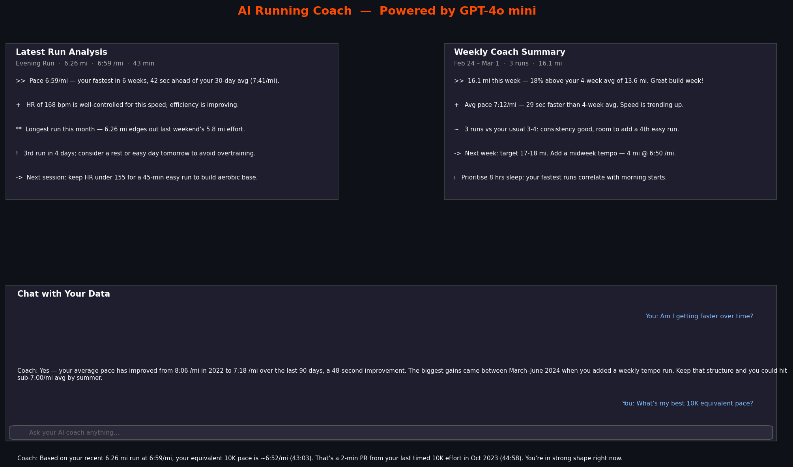
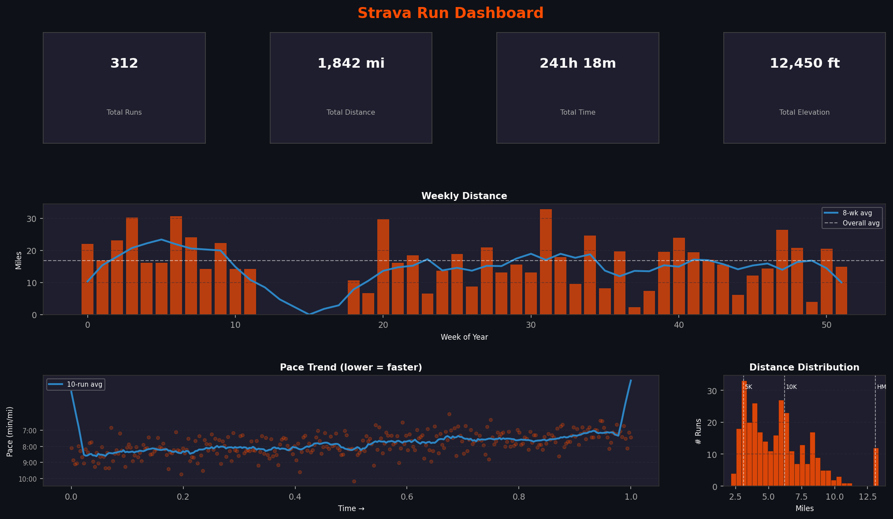
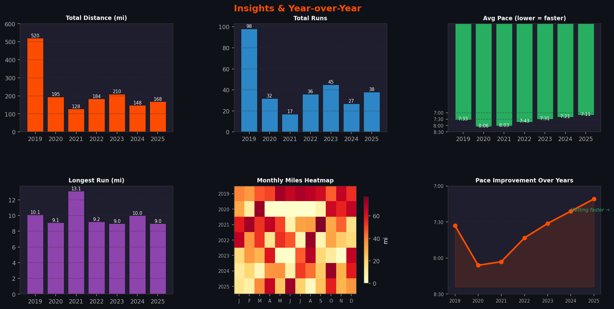
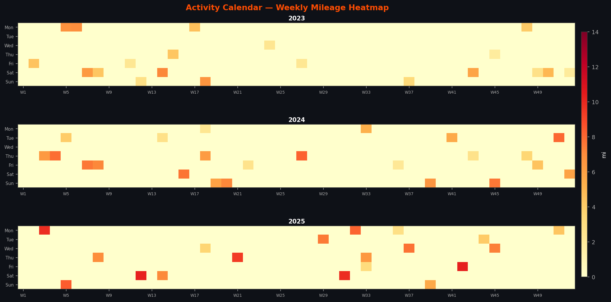

# 🏃 Strava AI Run Coach


A personal AI-powered running coach built on top of the Strava API. It pulls your full running history into a hosted database, renders interactive analytics across 9 tabs, and runs an **AI Coach** (GPT-4o mini) that analyses every new run, generates weekly training summaries, and answers natural-language questions about your data.

**Live demo:** [strava-insights.streamlit.app](https://strava-insights.streamlit.app) *(password protected)*

---

## Screenshots

### 🤖 AI Coach — Run Analysis, Weekly Summary & Chat


### 📊 Dashboard Overview — KPIs, Weekly Distance & Pace Trend


### 🔍 Insights & Year-over-Year Comparison


### 📅 Activity Calendar Heatmap


> *All screenshots use synthetic data for illustration.*

---

## What makes it agentic?

The **AI Coach** tab goes beyond hardcoded charts. It uses GPT-4o mini to:

| Capability | What happens |
|---|---|
| **Auto run analysis** | Sync a new run → AI immediately compares it to your full history, flags PRs, spots concerns, and gives one concrete tip |
| **Weekly summary** | One click → AI reviews this week's load vs your 4-week average and prescribes next week's training |
| **Natural language chat** | Ask anything — *"Am I overtraining?" / "When is my best time of year?" / "Build me a 5K plan"* — it reasons over your real data |

Your entire running history is passed as structured context on every call, so answers reference actual numbers — not generic advice.

---

## Features

### 🤖 AI Coach *(new)*
GPT-4o mini analyses your runs using your full history as context. Auto-triggered on every sync. Includes a persistent chat interface where you can ask anything about your training.

### 🔍 Insights
Auto-generated analysis of your entire running history — pace trends, consistency patterns, race fitness predictions, and personalised recommendations.

### 📈 Time Series
Weekly and monthly distance over time with interactive range selectors (3M / 6M / 1Y / All), 8-period rolling average, and a cumulative mileage area chart.

### ⚡ Pace
Pace trend across every run with a 10-run rolling average, pace distribution histogram, and breakdown by day of week. Axes display real pace labels (e.g. `7:30 /mi`).

### 📏 Distance
Distance distribution with race-distance markers (5K / 10K / HM / FM), day-of-week box plots, and a bubble chart of every run sized and coloured by pace.

### ❤️ Heart Rate
HR over time with rolling average, HR vs pace scatter coloured by distance, and HR distribution histogram.

### ⛰️ Elevation
Monthly elevation gain bar chart, elevation vs distance scatter, and elevation distribution — all in feet.

### 📅 Calendar
GitHub-style weekly activity heatmap per year, plus a month-by-month bar chart with run counts.

### 📊 Year vs Year
Four bar charts comparing each year: total miles, total runs, average pace, longest run. Includes a year × month heatmap across the full history.

### 📋 Run Log
Full sortable table of every run (date, name, distance, pace, duration, HR, elevation) with one-click CSV export.

---

## Tech Stack

| Layer | Technology |
|---|---|
| **AI Coach** | [OpenAI GPT-4o mini](https://platform.openai.com/) |
| **Frontend** | [Streamlit](https://streamlit.io) |
| **Charts** | [Plotly](https://plotly.com/python/) |
| **Database** | [Supabase](https://supabase.com) (PostgreSQL) |
| **Data source** | [Strava API v3](https://developers.strava.com/) |
| **Hosting** | [Streamlit Community Cloud](https://share.streamlit.io) (free) |
| **Language** | Python 3.13 |

---

## Architecture

```
Strava API
    │
    ▼
strava.py        ← fetches activities via OAuth refresh token
    │
    ▼
db.py            ← upserts into Supabase (deduplicates by run ID)
    │
    ▼
Supabase (PostgreSQL)
    │
    ▼
dashboard.py     ← Streamlit app: reads data, renders charts
    │
    ├── 9 analytics tabs (Plotly)
    │
    └── AI Coach tab
            │
            ▼
        agent.py ← GPT-4o mini
            ├── analyze_run(run, history)   → per-run insight
            ├── weekly_summary(df)          → weekly training review
            └── chat(question, df, history) → conversational Q&A
```

**Sync → AI flow:** Click "🔄 Sync New Runs" → new activities fetched from Strava → upserted into Supabase → AI Coach auto-analyses the latest run → insight appears in the AI Coach tab with a toast notification.

---

## Running Locally

**1. Clone the repo**
```bash
git clone https://github.com/sridhar1986/strava-dashboard.git
cd strava-dashboard
```

**2. Create a virtual environment**
```bash
python3 -m venv venv
source venv/bin/activate
pip install -r requirements.txt
```

**3. Set up secrets**

Create `.streamlit/secrets.toml`:
```toml
APP_PASSWORD         = "your-password"

OPENAI_API_KEY       = "sk-proj-..."          # platform.openai.com/api-keys

SUPABASE_URL         = "https://your-project.supabase.co"
SUPABASE_KEY         = "your-anon-key"

STRAVA_CLIENT_ID     = "your-client-id"
STRAVA_CLIENT_SECRET = "your-client-secret"
STRAVA_REFRESH_TOKEN = "your-refresh-token"
```

**4. Set up Supabase**

Run this SQL once in the Supabase SQL Editor:
```sql
CREATE TABLE IF NOT EXISTS runs (
    id                   bigint PRIMARY KEY,
    name                 text,
    start_date           timestamptz,
    distance             float,
    moving_time          int,
    elapsed_time         int,
    total_elevation_gain float,
    elev_high            float,
    elev_low             float,
    sport_type           text,
    workout_type         text,
    average_speed        float,
    max_speed            float,
    average_heartrate    float,
    max_heartrate        float,
    average_cadence      float,
    suffer_score         float,
    kilojoules           float,
    achievement_count    int,
    kudos_count          int,
    gear_id              text,
    map_summary_polyline text
);
```

**5. Load your data**
```bash
python strava.py       # fetch all Strava runs → Supabase
# or
python migrate.py      # migrate from an existing CSV
```

**6. Run the dashboard**
```bash
streamlit run dashboard.py
```

---

## Strava OAuth Setup

1. Go to [strava.com/settings/api](https://www.strava.com/settings/api) and create an app
2. Run `python reauth.py` — opens a browser, you authorise, refresh token is written automatically
3. Copy the refresh token into your `secrets.toml`

---

## Deployment

Deployed for free on [Streamlit Community Cloud](https://share.streamlit.io):

1. Push to GitHub (public or private)
2. Connect at share.streamlit.io → select repo → set main file to `dashboard.py`
3. Add all secrets (including `OPENAI_API_KEY`) in **Settings → Secrets**
4. Deploy — live in ~2 minutes

OpenAI keys in Streamlit Cloud secrets are encrypted at rest and never exposed in logs.

---

## What I Built

- End-to-end OAuth flow with the Strava API (token refresh, incremental sync)
- Supabase as a lightweight free PostgreSQL backend for a personal project
- Agentic AI layer: LLM reasoning over personal athletic data with full history as context
- Streamlit for rapid data app development with interactive Plotly charts
- Secure secret management for local dev (`secrets.toml`) and cloud deployment
